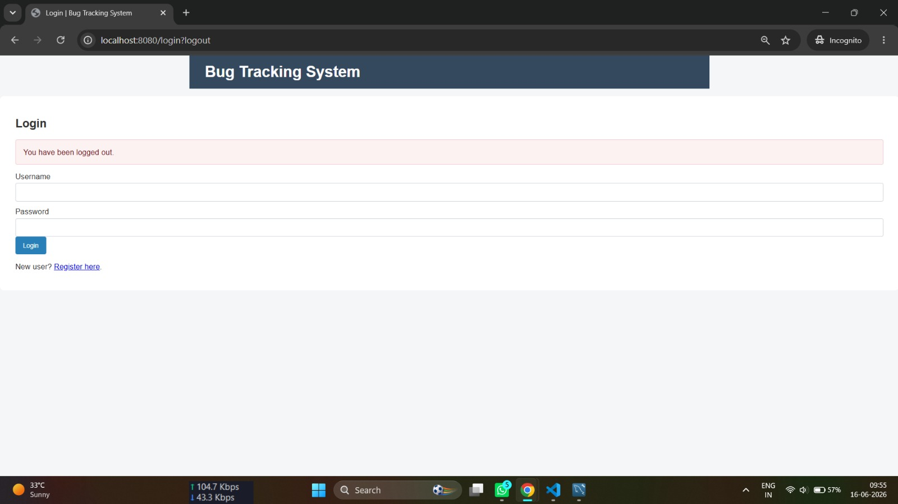
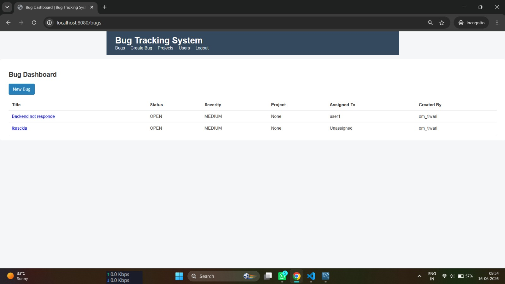
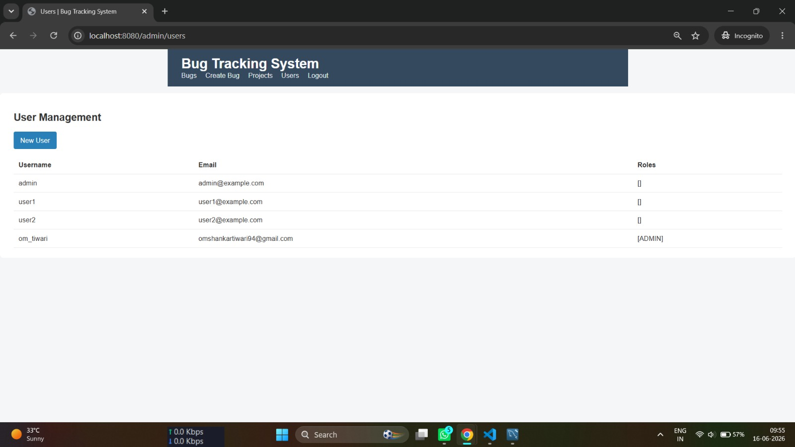
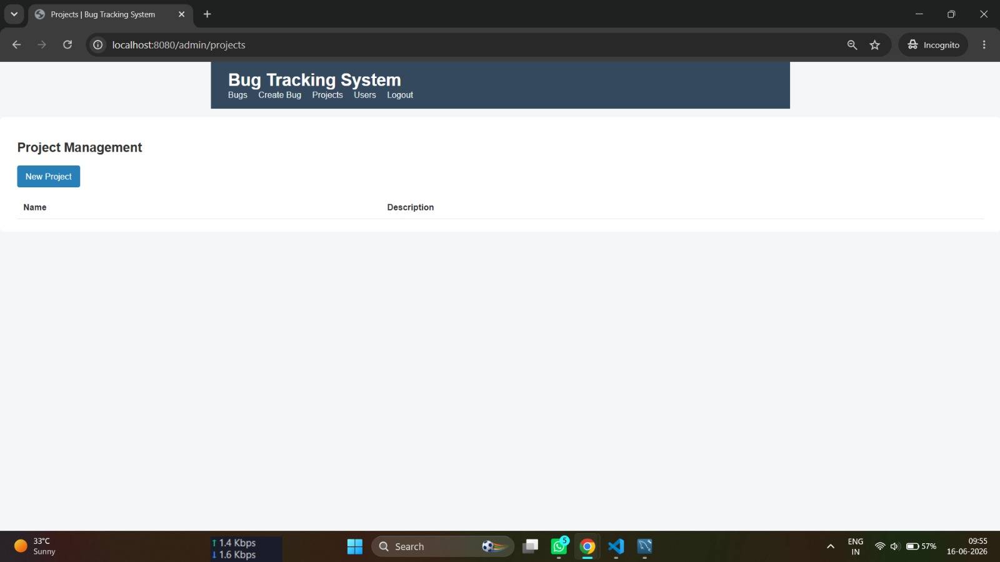
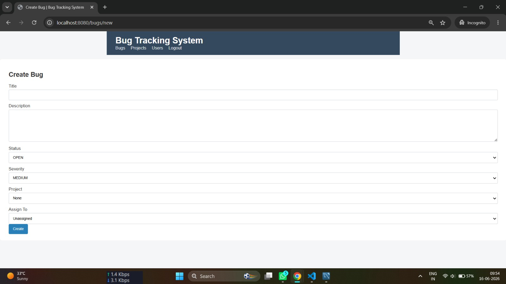

# 🐛 Bug Tracking System

A robust full-stack bug tracking and project management platform built utilizing the Java Spring ecosystem, Thymeleaf rendering engine, and MySQL relational database. Equipped with role-based access controls (RBAC) to securely isolate administrative operations and streamline developer tracking workflows.


---

## 📸 Application Interface Preview

### 🔐 Login Gateway


### 📊 Main Bug Management Dashboard


### 👥 Administrative User Grid View


### 📁 Project Tracks Management View


### 📝 Dynamic Ticket Creation Panel


---

---

## 🌟 Core Features

* **User Management:** Secure custom user registration and form-based session authentication pipelines.
* **Bug Lifecycle Tracking:** Full CRUD workflows for creating, updating, and tracking bug reports with statuses (`OPEN`, `RESOLVED`, `CLOSED`) and severities (`LOW`, `MEDIUM`, `HIGH`).
* **Project Management:** Administrative system grouping to easily organize bugs by separate parent projects (Restricted to Admins).
* **Interactive Comments:** Collaborative comment stream attached to individual bug sheets for deep team debugging.
* **Search & Filter:** Fast query interfaces to sort out open bug entities by dynamic user-specified conditions.
* **Role-Based Access Control (RBAC):** Strict security filters isolating administrative interfaces (`/admin/**`) from base user profiles.

---

## 💻 Technology Stack

* **Backend Framework:** Spring Boot 3.2.0, Java 17
* **Frontend View Engine:** Thymeleaf Template layouts
* **Database Management Engine:** MySQL 8.0 (Production) / H2 Engine (Development)
* **Security Layer:** Spring Security with cryptographic BCrypt password hashing
* **Object-Relational Mapping (ORM):** Hibernate / JPA Data streams
* **Project Build System:** Apache Maven Wrapper Framework

---

## 📁 Project Directory Framework

```text
backend/
├── .mvn/                        # Maven wrapper execution files
├── mvnw                         # Maven wrapper script for Linux/macOS
├── mvnw.cmd                     # Maven wrapper script for Windows PowerShell
├── pom.xml                      # Core project dependencies configuration file
├── src/
│   ├── main/
│   │   ├── java/com/example/bugtracker/
│   │   │   ├── config/      # Spring Security configurations (.hasAuthority mappings)
│   │   │   ├── controller/  # UI Routing controllers and request path parameters
│   │   │   ├── model/       # Relational JPA entity mappings and enums
│   │   │   ├── repository/  # CrudRepository interface data object layers
│   │   │   └── service/     # Unified business logic services (UserDetailsService)
│   │   └── resources/
│   │       ├── static/      # Static UI assets (CSS stylesheets, JS files, custom images)
│   │       ├── templates/   # Thymeleaf web page layouts (.html files)
│   │       ├── application.properties     # Production database configurations
│   │       └── application-dev.properties # Development H2 profile environment details
│   └── test/
│       └── java/com/example/bugtracker/
│           └── BugtrackerApplicationTests.java

🚀 Local Implementation Guide
Prerequisites
Java Development Kit (JDK): Version 17 or higher configured locally.

Apache Maven: Version 3.6+ (or use the included project script files directly).

Database Management System: Active MySQL server instance.

📦 Option A: Quick Development (In-Memory H2 Database)
If you just want to run the codebase quickly without setting up an external database, you can use the localized development profile layout:

Open your terminal inside the root directory and navigate to the backend module:

Bash
cd backend
Build and boot up the system container target pointing to the dev profile:

Bash
./mvnw spring-boot:run -Dspring-boot.run.profiles=dev
Load the interactive interface view inside your browser:
👉 http://localhost:8080

🗄️ Option B: Production Mode (Local MySQL Setup)
To track system modifications persistently inside your live relational schemas:

1. Setup Your Schema Instance
Open your MySQL Workbench instance or terminal shell, and run the schema setup instruction:

SQL
CREATE DATABASE bugtracker_db;
⚠️ Important Security System Initialization: Because the application reads role lists out of an isolated join table, if you want to elevate a default account to access the administrative dashboards, map the primary ID to the target join record:

SQL
INSERT INTO user_roles (user_id, role) VALUES (7, 'ADMIN');
2. Synchronize Your Credentials Properties
Open your local src/main/resources/application.properties configuration file, and confirm that your server credentials match your database context:

Properties
spring.datasource.url=jdbc:mysql://localhost:3306/bugtracker_db
spring.datasource.username=YOUR_MYSQL_USERNAME
spring.datasource.password=YOUR_MYSQL_PASSWORD
spring.jpa.hibernate.ddl-auto=update
3. Compile and Run the Server
Execute the default Maven runtime wrapper statement from your VS Code terminal window:

PowerShell
.\mvnw clean spring-boot:run
Once your console logs display that the Tomcat engine has initialized on port 8080, head right to your browser gate at: http://localhost:8080/login

🔒 Verified Security Endpoints Reference
GET /login & GET /register ➡️ Public Channels (Accessible by everyone)

GET /bugs/ & POST /bugs/ ➡️ Authenticated Channels (Requires active login context)

GET /admin/projects ➡️ Restricted View (Requires verified ADMIN Authority)

GET /admin/users ➡️ Restricted View (Requires verified ADMIN Authority)

📝 Unit Testing
Verify your application controllers, database repositories, and access handling configurations by invoking the Maven test engine:

PowerShell
.\mvnw test
📄 License
Distributed under the MIT License. See LICENSE for more information.